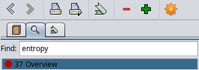

## Overview



This lab is designed to show you how to use reverse engineering tools to figure
out if a program is packed. Malware often uses packing to hide its code and make
it harder for reverse engineers to understand what the program is doing.

**Goals:**

- Understand what a packed program looks like
- Introduce concept of Entropy
- Practice using reverse engineering tools

**Estimated Time:** `45 Minutes`



## Instructions

{}

### Examine a non-packed file



### Open the program in `exespy`

Navigate to the entropy tab in `exespy` and look at the line plot first. Think
about the structure of the program, why might some spots have high entropy while
others have very low entropy?

1. **What happens as you change the block size?**

The heat map might give you a better unstanding of the program structure.

2. **Do you notice any patterns at any specific block sizes?**

### Open the program in `Ghidra`

Run the auto analysis and while thats running open the manual by selecting
`Help > Contents` or by pressing `F1`. Go to the search tab and search for
`entropy`. This should take you to the "Overview" page.

In the `program trees` window, double click on the `.text` section.

3. **What does the `.text` section contain?**
4. **What entropy value(s) do you see?**

Next double click on the `.data` section.

5. \*\*What does the `.data` section contain?
6. **What entropy value(s) do you see?**

### Now examine a mystery packed file



### Run the program to see what it does



This program is NOT malicious, it is safe to run.



7. **Do you see any of the text as a string in the program?**

### Open in `exespy` and `Ghidra`

8. **Describe what differences you see from the first program you looked at.**

### Figure out how to unpack it

9. **What command (or any other method) did you use to unpack the program?**

<!-- ### Common malware packers? Are the following programs packed? -->

<!-- TODO -->

{}

## Tips

- Read the Ghidra Manual! Theres so much information in it.
- This is not necessarily a sure way to tell if a program is packed.

## Submission



Submit a markdown file with any code you wrote and the answers to questions to
[ELMS](https://umd.instructure.com/courses/1374508/assignments).


