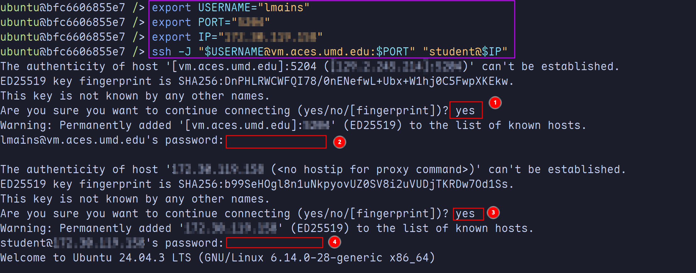

> [!WARNING]
>
> If you are opening up the `ssh` port, then it is recommended that you change
> the password of the `student` user to something other than the default!
>
> ```sh {filename=Bash}
> # To change the current user's password run:
> student@hacs408e-vm ~> passwd
> ```

{}

### Get the IP address of your Linux VM.

```{filename=Bash}
student@hacs408e-vm ~> ip -c a
```

### Navigate to [`https://ams.aces.umd.edu`](https://ams.aces.umd.edu) from a browser to get your jump box information.

> [!NOTE]
> You will need to be on UMD's Wi-Fi or
> [connected to their VPN](https://itsupport.umd.edu/itsupport?id=kb_article_view&sysparm_article=KB0016076)
> to access the site.

Setting up port forwarding is not necessary to use ssh to connect to your
HACS408E VM. All you'll need is the port number from the main page of the ACES
management system.


The above picture shows:

1. Your username for the ssh connection
2. The port number used to connect to the ssh server running on your class VM

### Try connecting to your VM:

With the above information you should be able to connect to your HACS408E VM:

```{filename="Run in a Terminal"}
ssh -X -J <USERNAME>@vm.aces.umd.edu:<PORT> student@<HACS408E_VM_IP_ADDRESS>
```

> [!NOTE]
>
> You will need to replace the following fields (including the angle brackets
> `<>`):
>
> - `<USERNAME>`
> - `<PORT>`
> - `<hacs408e-vm_IP_ADDRESS>`

This will prompt you for two passwords:

1. The first sets up a connection to the jump box and this will be your normal
   UMD login password.
2. The second connection is the one to your HACS408E VM and will be the password
   to the `student` account.

Here is an example walking through the connection:



The box in purple shows how to set envrionment variables corresponding to the
fields mentioned above. These variables are then used in the ssh command to
connect to the VM. The boxed in red show the places where you enter user input
when connecting to the VMs for the first time. Make sure to enter the correct
passwords for each username when prompted.

### (Optional) Save settings in your `ssh config`:

```yaml {filename="$HOME/.ssh/config/"}
# This is the connection info for your AMS aces vm:
Host aces-vm
  HostName vm.aces.umd.edu
  User <USER>
  Port <PORT>
  ForwardX11 yes

# Fill in the ip address you got earlier here:
Host hacs408e-vm
  HostName <HACS408E_VM_IP_ADDRESS>
  User student
  ProxyJump aces-vm
  ForwardX11 yes
```

> [!NOTE]
> You must fill in everything in brackets (`<...>`) in the above config file!
> Again, don't forget to remove the angle brackets.

```{filename=Bash}
ssh hacs408e-vm
```

{}

> [!TIP]
> Check out the `ssh-copy-id`
> [man page](https://man7.org/linux/man-pages/man1/ssh-copy-id.1.html) if you
> want to be able to automatically sign in as the student user without entering
> your password.
>
> You will need to run `ssh-copy-id` for each ssh connection:
>
> ```shell
> # Enter UMD password to copy private key to Aces class VM
> ssh-copy-id -p $PORT lmains@vm.aces.umd.edu
>
> # Enter `student` password to copy private key to HACS408E VM
> ssh-copy-id -J lmains@vm.aces.umd.edu:$PORT student@hacs408e-vm
> ```

### Viewing GUI Programs over SSH

You will need an X11 server running on your host machine to view GUI programs
over ssh. Here are the recommended programs for each OS.

|      OS | Program                                                                                                                      |
| ------: | :--------------------------------------------------------------------------------------------------------------------------- |
| Windows | Free Option: [MobaXTerm](https://mobaxterm.mobatek.net/)                                                                     |
|   MacOS | Free Option: [XQuartz](https://www.xquartz.org/)                                                                             |
|   Linux | If you set up your `ssh` config as above, you should be good to go! Otherwise, make sure to add `-X` when you ssh to the VM. |
