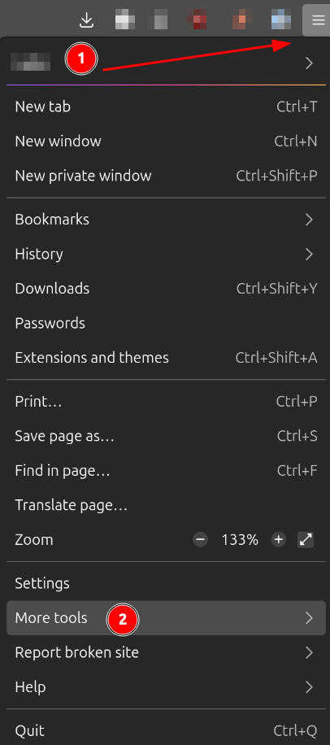

## Overview



TODO

**Goals:**

- Review Javascript/HTML source code
- Learn about HTTP requests and how web servers work

**Estimated Time:** `45 Minutes`



## Instructions

{}

### Find the Web Root Directory

Now that we know `uhttpd` is the web server used to serve files when the router
starts up, let's look for things related to it. Read through the corresponding
init script in `squashfs_root/etc/init.d/` and find the home directory where the
HTML/Javascript files are stored.



Where is the configuration information for the `uhttpd` service stored?
<br></br> What is the root directory for the web server?



> [!TIP]
> Use the `fd` or `find` commands to look for files with `uhttpd` in the name.

### Manually Serving the Web Content

The web interface is one of the main ways to interact with the router and is a
great place to analyze for vulnerabilities. One of the best tools to analyze web
content like HTML and Javascript is something you're already familiar with: a
web browser!

To get the most out of looking at web content we should serve the files
dynamically like the router would (rather than just opening up the html file
from the disk). Under normal circumstances, it would be best to make the system
look as 'normal' as possible. This would entail full emulation of the system and
using `uhttpd` to serve the web files. While it is possible to run the `uhttpd`
server by itself using emulation, for this lab, we can use something much
simpler.

An easy to use static file server is Python's `http.server` module:

```bash {filename=Bash}
# cd into the web root directory
python -m http.server 8080
```

Then browse to the page at `http://localhost:8080`



What is the default page that you get redirected to?



Next use the browsers developer tools to find where the text fields and button
are in the HTML code.

> [!TIP]
>
> You can open the developer tools by pressing `F12` (sometimes `Fn + F12`) or
> by opening it from the hamburger menu.
>
> </img>

Use the "Select Element" icon on the leftmost side of the dev tools toolbar to
highlight pieces of the web page to inspect.



What is the `id` attribute of the button on the main page?<br></br> Does it have
a registered function when you press it?



### Understanding how System Components Work Together

Use VSCode (or any other editor you want) to view the contents of the
`squashfs_root/www` folder. Use `Ctrl + Shift + F` to search for the function
that runs when the button is clicked. Review just the code for that function and
try to figure out what it does. Try to see if it is related to html code near
the `<button>` object with the id you found above.

> [!NOTE]
>
> The code may be a little difficult to follow because
>
> 1. Connected code and HTML is not necessarily close together because it is a
>    dynamic web application
> 2. It uses `JQuery`
>
> Check the homepage of the [JQuery Website](https://jquery.com/) for quick
> explanation of the `$('foo.bar')` syntax.



What happens when you complete the form for the first time login page?





What types of
[HTTP Requests](https://en.wikipedia.org/wiki/HTTP#HTTP/1.1_request_messages)
are made when you first open the site and click the login button? <br></br>
HINT: Check the terminal where you ran the python HTTP server.



### Exploring the Lua Side of Things

### Finding Vulnerabilities

You've explored many parts of the firmware for the `ARCHER C7` Router. Your last
task is to look into other reported vulnerabilities for our version of the
firmware. There are a few different
[CVE](https://www.redhat.com/en/topics/security/what-is-cve) databases security
researchers to report and identify vulnerabilities in programs. You can search
for issues related to our device using the following link:

- [`https://cve.mitre.org/cgi-bin/cvekey.cgi?keyword=AC1750`](https://cve.mitre.org/cgi-bin/cvekey.cgi?keyword=AC1750)

Find `CVE-2020-10886`.



Is the vulnerable program in our firmware dump? (I.e can you find it in the
extracted filesystem?)



{}

## Tips

- [`man chroot`](https://man7.org/linux/man-pages/man2/chroot.2.html)
- [OpenWRT Init Scripts](https://openwrt.org/docs/techref/initscripts)

## Submission



Submit a report with answers to questions to
[ELMS](https://umd.instructure.com/courses/1374508/assignments).


